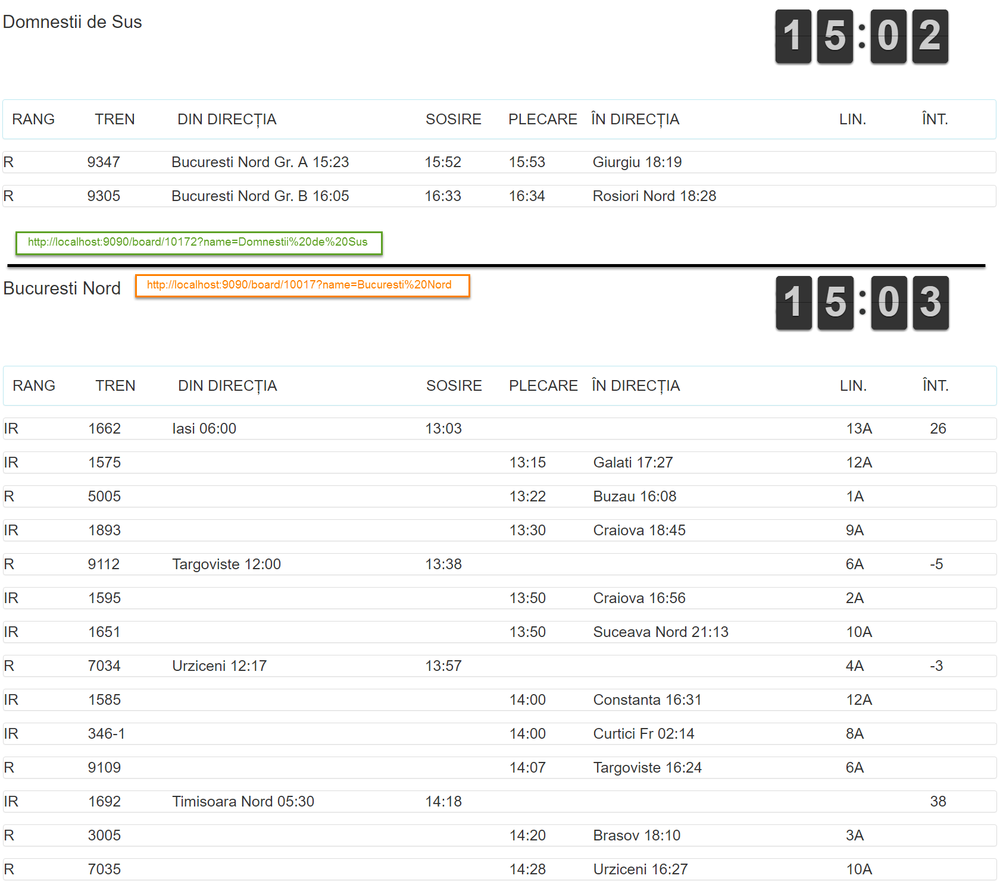

# Web-based train station departure board

This project uses my [CFR IRIS Scraper](https://github.com/BodoMinea/cfr-iris-scraper) to display a web train departure & arrival board from a station in Romania, using data automatically updated every 15 minutes (remember this is scraping) with times, lines, trips and delays from the national railway infrastructure administration company CFR S.A.'s [live information service](http://appiris.infofer.ro/SosPlcRO.aspx).

### Installation & Requirments
Exactly as the API server it's based on: [CFR IRIS Scraper](https://github.com/BodoMinea/cfr-iris-scraper): make sure you have NodeJS and NPM on your system, go from the terminal to the folder where you cloned the repo and `npm install` to get the module dependencies. Now you need [PhantomJS](http://phantomjs.org/download.html) installed on your system or the single executable dropped into the repo folder. Afterwards, just `node .` to run.

### Usage
Now you can point your browser to **http://localhost:9090/board/ID?name=NAME** to see the magic. ID is the unique station-unit code, you have [a list of those in this very nice repo](https://github.com/vasile/data.gov.ro-gtfs-exporter/blob/master/cfr.webgis.ro/stops.geojson), and NAME is optional and is used just to set the heading title text. For example, to get a departure and arrivals board with title "Bucuresti" for the Bucharest North railway station, after setting up the requirments for the server and running it, you would navigate to http://localhost:9090/board/10017?name=Bucuresti.
### To-Do
- Use Bower for web dependencies (Bootstrap, jQuery, Angular, FontAwesome and others are bundled for now, even though some are not even used - but there are future plans for this project)
- Departure or arrival only display (with URL parameter)
- Dark mode (with URL parameter)
- Optional sound alerts and notices
- Mark currently departing or arriving trains with a different color or color blinking
- Allow multiple clients with different requested station IDs
### License, disclaimer and known limitations
This is a completely open source project, built on open source modules and libraries and licensed under [Apache License 2.0](https://www.apache.org/licenses/LICENSE-2.0.html).

Also read the notes of the original repo [CFR IRIS Scraper](https://github.com/BodoMinea/cfr-iris-scraper) please.

Known limitations:
- You can display multiple boards (clients) using one server, but only for the same station ID, otherwise you'll run into some trouble, bugs or conflicts.
- Dipslayed train trips are cleared off the board when they are cleared from the information service, which isn't the most efficient in terms of time and space on the display.